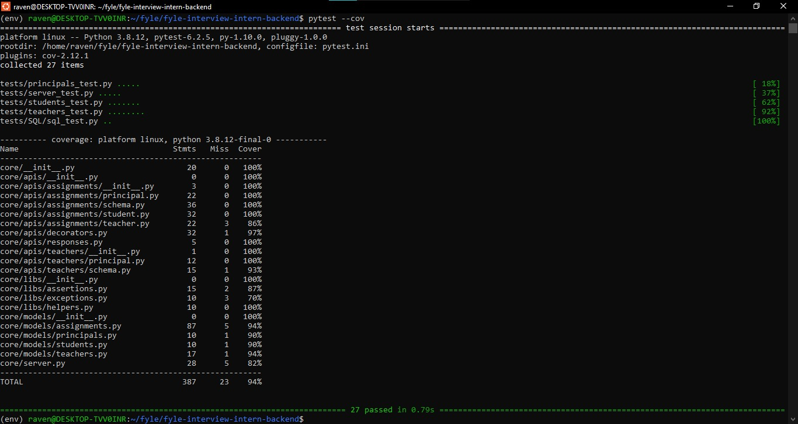
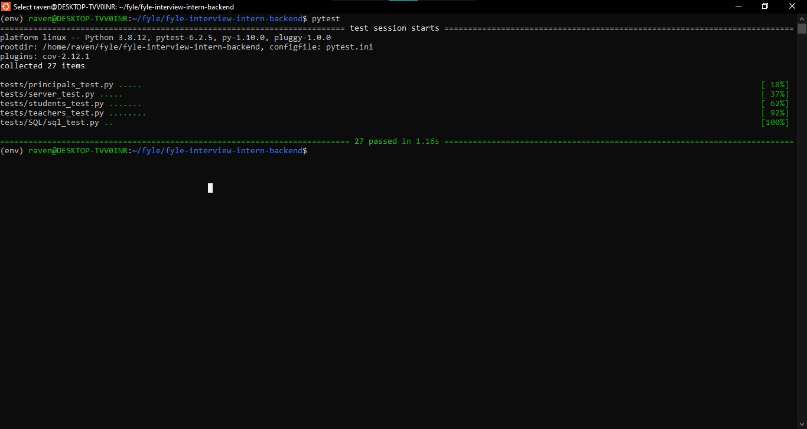
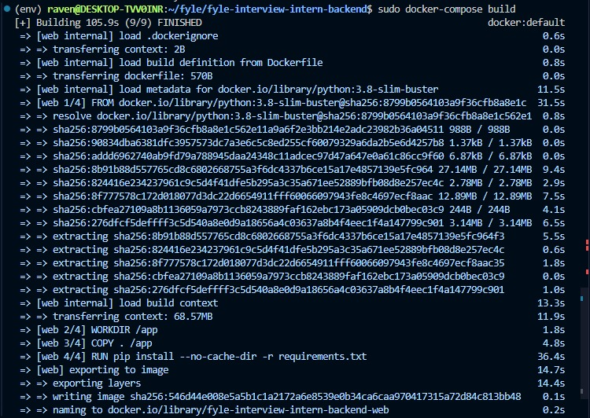
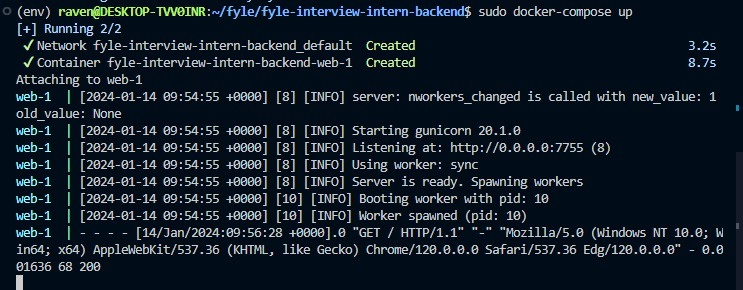

# AssignmentMS_API: A REST API for Educational Assignments(Fyle Backend Assignment)

## Details

AssignmentMS_API is a project that aims to provide a simple and efficient way to manage assignments for students, teachers, and principals in an educational institution. The project uses Python 3.8 as the backend language, SQLite as the database, and SQLAlachemy as the database management tool. The project follows the RESTful principles and uses JSON as the data format.

## The main features of the project are:

- **Authentication and authorization** using X-Principal header and user_id and student_id values
- **CRUD (Create, Read, Update, Delete) operations** for users, principals, students, teachers, and assignments
- **Submission and grading of assignments** by students and teachers
- **Re-grading of assignments** by principals
- **Validation and exception handling** for user inputs and errors
- **Unit testing** using pytest and coverage
- **Dockerization** using Dockerfile and docker-compose.yml

## API Details
API details are discussed [here](Application.md)

## Installation

1. Fork this repository to your github account
2. Clone the forked repository and proceed with steps mentioned below

### Install requirements

```
virtualenv env --python=python3.8
source env/bin/activate
pip install -r requirements.txt
```
### Reset DB

```
export FLASK_APP=core/server.py
rm core/store.sqlite3
flask db upgrade -d core/migrations/

ALT
bash reset.sh
```
### Start Server

```
bash run.sh
```
### Run Tests

```
pytest -vvv -s tests/

# for test coverage report
# pytest --cov
# open htmlcov/index.html
```

### Run Docker

```
docker-compose build
docker-compose up
```

## Screenshots
### Test Coverage
#### Result(94%)


### Test Cases
#### Passes(27)



### Docker Working Screenshot



